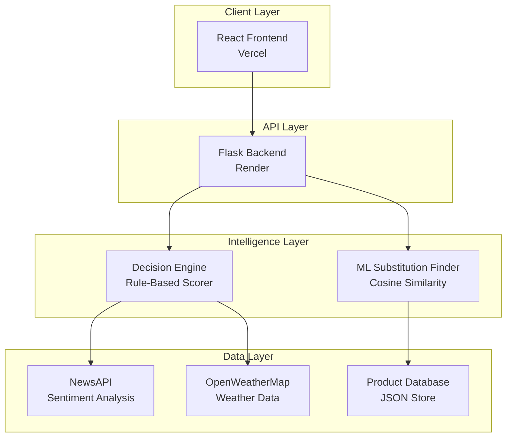

# StoreIQ 🛍️

**The Tariff-Aware Procurement & Substitution Engine**

> A full-stack web application that empowers retail procurement managers to make smarter, data-driven purchasing decisions in today's volatile global market.


---


##  Overview

StoreIQ transforms complex procurement analysis into simple, confident decisions. By ingesting real-time data on tariffs, news sentiment, and inventory levels, it provides clear, actionable recommendations that turn uncertainty into strategic advantage.


## ✨ Key Features

### 🧠 Intelligent Procurement Engine
- **Smart Recommendations**: Get one of five clear actions: Bulk Order, Standard Order, Monitor, Hold, or Use Substitute
- **Transparent AI**: See exactly why each recommendation was made with detailed explanations
- **Real-time Analysis**: Incorporates live market data for up-to-the-minute insights

### 📊 Advanced Data Integration
- **News Sentiment Analysis**: Leverages NewsAPI and NLP to gauge market demand
- **Weather Impact Assessment**: Factors in weather data for logistics and supply chain planning
- **Dynamic Tariff Monitoring**: Tracks tariff changes and their impact on profitability

### 🔄 ML-Powered Substitutions
- **Content-Based Filtering**: Uses Cosine Similarity to find optimal product alternatives
- **Cost-Effective Alternatives**: Automatically suggests substitutes when tariffs make products too expensive
- **Similarity Scoring**: Ranks alternatives based on features like category, price, brand, and size

### 📈 Interactive Dashboard
- **Clean, Responsive UI**: Built with React for seamless user experience
- **Data Visualization**: Chart.js integration for clear performance insights
- **Real-time Updates**: Live data feeds keep information current

## 🏛️ Architecture

StoreIQ uses a modern, decoupled architecture optimized for performance and scalability:



## 🛠️ Tech Stack

| Component | Technology | Purpose |
|-----------|------------|---------|
| **Frontend** | React, Axios, Chart.js | Dynamic UI and data visualization |
| **Backend** | Python, Flask, Flask-CORS | REST API and business logic |
| **ML/AI** | scikit-learn, pandas, TextBlob | Similarity matching and NLP |
| **Data Sources** | NewsAPI, OpenWeatherMap | Real-time external data |
| **Deployment** | Vercel, Render | Scalable cloud hosting |

## 🚀 Quick Start

### Prerequisites
- Node.js (v14 or higher)
- Python 3.8+
- npm or yarn

### 1. Clone the Repository
```bash
git clone https://github.com/your-username/storeiq.git
cd storeiq
```

### 2. Backend Setup
```bash
# Navigate to backend
cd backend

# Create virtual environment
python -m venv venv
source venv/bin/activate  # Windows: venv\Scripts\activate

# Install dependencies
pip install -r requirements.txt

# Download NLP corpora
python -m textblob.download_corpora
```

Create `.env` file in backend directory:
```env
NEWS_API_KEY="your_newsapi_key_here"
OPENWEATHER_API_KEY="your_openweathermap_key_here"
```

Start the backend server:
```bash
flask run --port 5001
```

### 3. Frontend Setup
```bash
# Navigate to frontend (new terminal)
cd frontend

# Install dependencies
npm install
```

Create `.env.local` file in frontend directory:
```env
REACT_APP_API_BASE_URL=http://localhost:5001/api
```

Start the development server:
```bash
npm start
```

🎉 **Your app is now running at `http://localhost:3000`!**

## 🧠 How It Works

### Decision Engine Algorithm

StoreIQ's core intelligence combines rule-based scoring with machine learning:

#### 1. **Multi-Factor Scoring**
- **Cost Impact**: Analyzes tariff rates and their effect on profitability
- **Demand Score**: Processes news sentiment to gauge market demand
- **Urgency Score**: Calculates remaining stock days based on sales velocity

#### 2. **Decision Matrix**
The engine maps score combinations to actionable recommendations:

```python
if cost_impact > 0.8 and demand_score > 0.6:
    return "BULK_ORDER"
elif cost_impact > 0.6 and urgency_score < 0.3:
    return "USE_SUBSTITUTE"
# ... additional logic
```

#### 3. **Substitution Model**
When substitutions are recommended:
- Products are vectorized based on features (category, price, brand, size)
- Cosine similarity calculates the "distance" between products
- Top matches (similarity > 0.8) are returned as alternatives

## 📊 API Documentation

### Core Endpoints

#### Get Product Recommendations
```http
GET /api/recommendations?product_id=123
```

**Response:**
```json
{
  "product_id": "123",
  "recommendation": "BULK_ORDER",
  "confidence": 0.85,
  "reasoning": {
    "cost_impact": 0.3,
    "demand_score": 0.7,
    "urgency_score": 0.9
  },
  "substitutes": []
}
```

#### Get Product Substitutes
```http
GET /api/substitutes?product_id=123&limit=5
```

**Response:**
```json
{
  "original_product": "Product Name",
  "substitutes": [
    {
      "product_id": "456",
      "name": "Alternative Product",
      "similarity_score": 0.92,
      "price_difference": -15.5
    }
  ]
}
```

## 🚀 Deployment

### Frontend (Vercel)
1. Connect your GitHub repository to Vercel
2. Set environment variables in Vercel dashboard
3. Deploy automatically on push to main branch

### Backend (Render)
1. Create a new Web Service on Render
2. Connect to your GitHub repository
3. Set environment variables in Render dashboard
4. Deploy with automatic builds

## 🔮 Roadmap

- [ ] **User Authentication** - Multi-tenant support for store managers
- [ ] **Database Integration** - PostgreSQL/MongoDB for persistent storage
- [ ] **Advanced ML Models** - XGBoost for predictive recommendations
- [ ] **Real-Time Streams** - WebSocket integration for live updates
- [ ] **Mobile App** - React Native companion application
- [ ] **Advanced Analytics** - Historical performance tracking

## 🤝 Contributing

We welcome contributions! Please see our [Contributing Guidelines](CONTRIBUTING.md) for details.

1. Fork the repository
2. Create a feature branch (`git checkout -b feature/amazing-feature`)
3. Commit your changes (`git commit -m 'Add amazing feature'`)
4. Push to the branch (`git push origin feature/amazing-feature`)
5. Open a Pull Request

## 📄 License

This project is licensed under the MIT License - see the [LICENSE](LICENSE) file for details.

## 👏 Acknowledgments

- **NewsAPI** for providing real-time news data
- **OpenWeatherMap** for weather information
- **The open-source community** for amazing libraries and tools

---

<div align="center">

[⭐ Star this repo](https://github.com/your-username/storeiq) | [🐛 Report Bug](https://github.com/your-username/storeiq/issues) | [✨ Request Feature](https://github.com/your-username/storeiq/issues)

</div>
